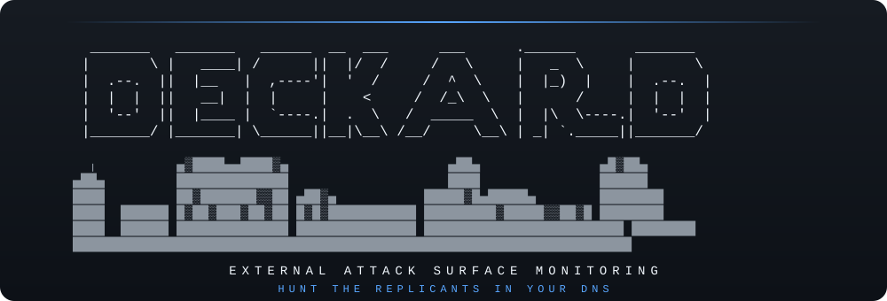
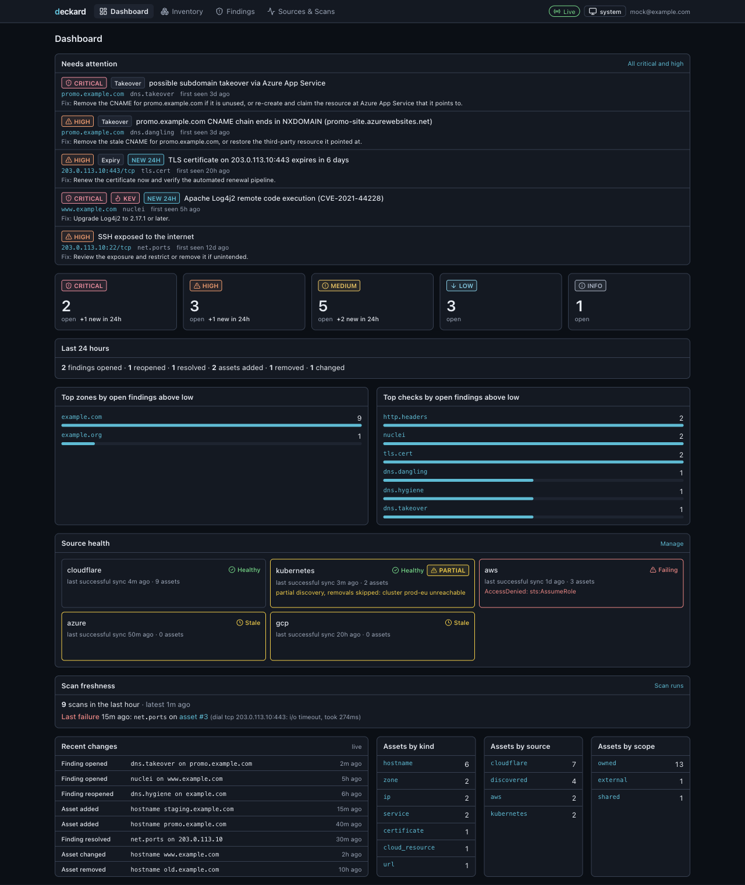
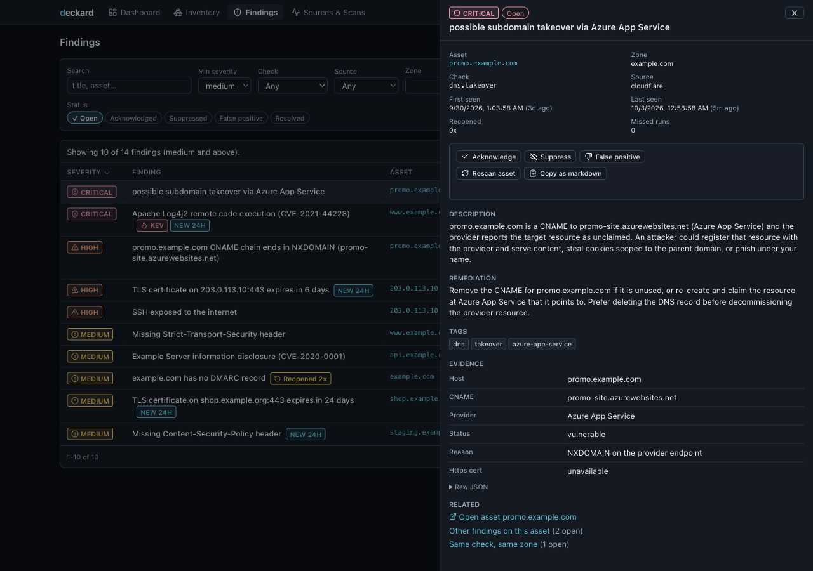
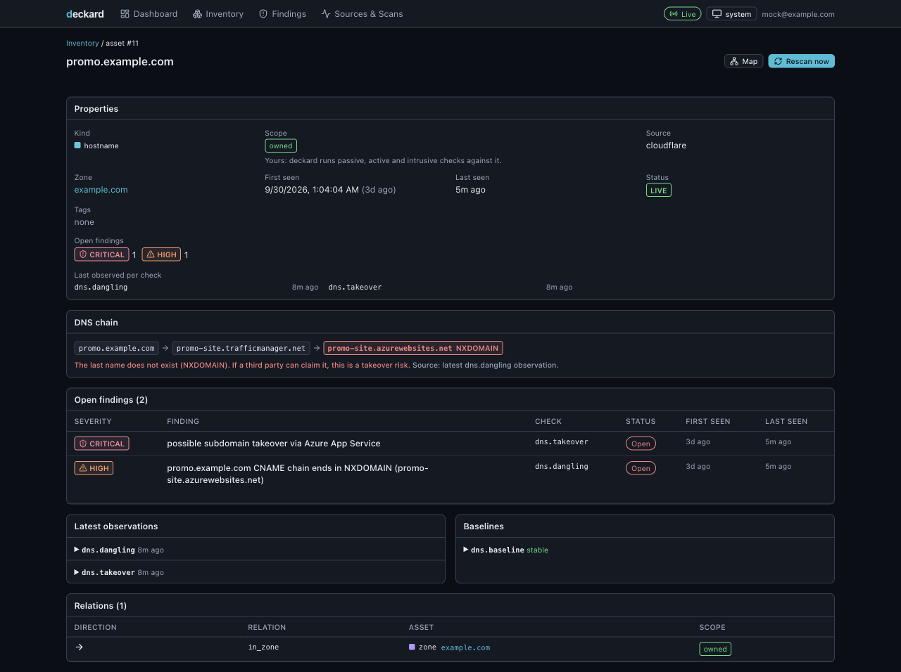
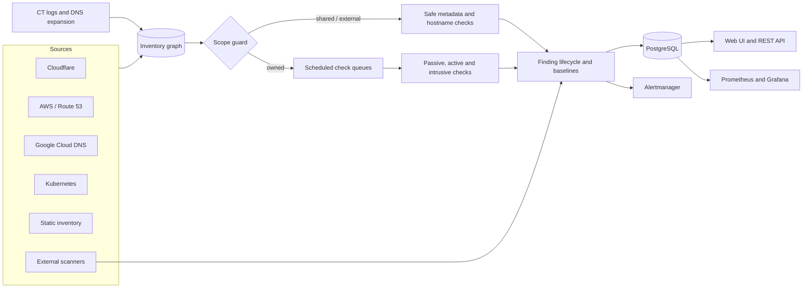

<p align="center">
  
</p>

<h1 align="center">deckard</h1>

<p align="center">
  <strong>Self-hosted, continuous external attack-surface monitoring.</strong><br>
  Discover what you expose. Re-check it continuously. Know when it drifts, dangles or becomes vulnerable.
</p>

<p align="center">
  <a href="https://github.com/chainseer-xyz/deckard/actions/workflows/ci.yml"></a>
  <a href="https://github.com/chainseer-xyz/deckard/tags"></a>
  <a href="LICENSE"></a>
  
</p>

<p align="center">
  <a href="#quick-start">Quick start</a> ·
  <a href="#what-deckard-does">Features</a> ·
  <a href="#what-it-finds">Checks</a> ·
  <a href="#deploy-on-kubernetes">Kubernetes</a> ·
  <a href="#how-it-works">Architecture</a> ·
  <a href="#documentation">Documentation</a>
</p>

---

Deckard builds an inventory from Cloudflare, AWS, Google Cloud and Kubernetes, then continuously checks the assets you own. It remembers what it saw, resolves findings when problems disappear, and sends actionable alerts through Prometheus Alertmanager.

Unlike a folder of one-shot recon output, Deckard keeps a living model of your attack surface: assets, relationships, scan history, baselines and finding state. It runs as one application plus PostgreSQL and includes a web UI, REST API, Prometheus metrics and Grafana dashboard.

> [!CAUTION]
> Use Deckard only on infrastructure you own or are authorised to test. Active checks enforce an ownership-based scope guard, but you remain responsible for provider policies and scan authorisation. Read [Responsible use](#responsible-use) before enabling active checks.

## Quick start

### Requirements

- Docker Engine or Docker Desktop with Compose
- A read-only Cloudflare API token, or another configured [inventory source](#inventory-sources)
- About five minutes

```sh
git clone https://github.com/chainseer-xyz/deckard.git
cd deckard
cp .env.example .env
$EDITOR .env
$EDITOR deploy/compose/deckard.yaml
docker compose up -d
docker compose logs -f deckard
```

Set these values in `.env`:

| Variable | Required | Purpose |
|---|---:|---|
| `DECKARD_ADMIN_TOKEN` | yes | API and UI bearer token; generate at least 32 bytes with `openssl rand -hex 32` |
| `POSTGRES_PASSWORD` | yes | Local Compose database password; generate with `openssl rand -hex 24` |
| `CF_API_TOKEN` | for the default example | Read-only Cloudflare discovery token |

The Cloudflare token needs `Zone:Read`, `DNS:Read`, zone and account `Load Balancers:Read`, `Account Settings:Read` and `Cloudflare Tunnel:Read`.

Open the UI at [http://127.0.0.1:8080](http://127.0.0.1:8080). Prometheus metrics are available at [http://127.0.0.1:9090/metrics](http://127.0.0.1:9090/metrics).

The default Compose stack binds both ports to loopback. It starts PostgreSQL automatically and stores Deckard's mutable data in named volumes.

Start the included example Alertmanager when you want to test notifications:

```sh
docker compose --profile alerting up -d
```

## What Deckard does

| Capability | How it works |
|---|---|
| Inventory from authority | Reads Cloudflare, Route 53, AWS resources, Google Cloud DNS, Kubernetes and static declarations |
| Continuous checks | Scans new assets immediately and re-checks them on configurable per-tier and per-check schedules |
| Ownership-aware scope | Separates owned, shared and external infrastructure before any active probe runs |
| Finding lifecycle | Deduplicates findings and tracks open, acknowledged, suppressed, false-positive and resolved states |
| Change detection | Learns stable observations and reports meaningful DNS, HTTP and TLS drift |
| Fresh intelligence | Refreshes takeover fingerprints, shared-hosting ranges, Nuclei templates, CISA KEV and FIRST EPSS data |
| External scanner ingest | Reconciles Prowler, Kubescape, trufflehog, gitleaks, s3scanner and SARIF results into the same lifecycle |
| Operations built in | Exposes a web UI, REST API, SSE stream, Prometheus metrics, alert rules and a Grafana dashboard |

### Why continuous inventory matters

The failures that hurt most often appear after a point-in-time audit:

- a CNAME survives after its service is deleted;
- a certificate stops renewing;
- a test port becomes permanent;
- a cloud origin becomes reachable around its CDN;
- a new CVE lands against technology already in production;
- a source sync becomes partial and silently stops seeing assets.

Deckard keeps re-evaluating the inventory and retains enough history to distinguish a new problem from an old baseline.

## What it looks like

<p align="center">
  
</p>

The dashboard puts urgent findings and source health first. A partial source sync is visible and cannot remove assets from the inventory.

<table>
  <tr>
    <td width="50%"></td>
    <td width="50%"></td>
  </tr>
  <tr>
    <td><sub><strong>Investigate a finding:</strong> review evidence and remediation, acknowledge it, suppress it with a note, mark it false-positive or trigger a rescan.</sub></td>
    <td><sub><strong>Understand an asset:</strong> inspect ownership scope, source lineage, DNS relationships, services, scan history and learned baselines.</sub></td>
  </tr>
</table>

## What it finds

| Tier | Check | Detects |
|---|---|---|
| passive | `dns.dangling` | CNAME chains ending in NXDOMAIN and dangling NS delegations |
| passive | `dns.takeover` | Provider takeover fingerprints for S3, GitHub Pages, Heroku, Azure, CloudFront and others |
| passive | `dns.hygiene` | SPF, DMARC, CAA and DNSSEC gaps; wildcard records; open AXFR |
| passive | `mail.policy` | Missing MTA-STS and TLS-RPT, weak DMARC policy and soft-fail SPF on mail zones |
| passive | `domain.expiry` | Expiry risk, missing registry locks, and registrar or nameserver changes through RDAP |
| passive | `domain.lookalike` | Registered typosquats and lookalikes, with mail-capable domains raised in severity |
| passive | `intel.internetdb` | Reported CVEs, unexpected ports, and compromised or malware tags from Shodan InternetDB |
| passive | `web.history` | Sensitive files and administrative paths previously observed by the Wayback Machine |
| passive | `cloud.bucket` | Publicly listable S3, Google Cloud Storage and Azure Blob containers behind hostnames |
| passive | `tls.cert` | Expiry, hostname mismatch, weak keys and self-signed certificates |
| passive | `http.probe`, `http.headers` | Reachability, technology fingerprinting and missing security headers |
| passive | `origin.exposed`, `origin.correlation` | Directly reachable CDN origins and origins disclosed by unproxied records |
| active | `net.ports`, `net.services` | Unexpected ports and unauthenticated databases, caches and administrative services |
| active | `tls.config` | TLS 1.0 or 1.1 and weak cipher configuration |
| active | `http.exposed` | Exposed `.git`, `.env`, backups, directory listings and framework diagnostics |
| active | `cve.nuclei` | Known CVEs and misconfigurations through Nuclei's official templates and Deckard finder pack |

Findings that reference a CVE are enriched with CISA Known Exploited Vulnerabilities and FIRST EPSS data. Add organisation-specific checks with [Nuclei templates](docs/configuration.md#custom-templates) or [exec plugins](docs/plugins.md).

## How it works



### Check tiers

- **Passive** checks use DNS, certificate, HTTP and restricted metadata lookups comparable to ordinary client traffic.
- **Active** checks make bounded connections to owned destinations. They are rate-limited and concurrency-limited.
- **Intrusive** checks are disabled by default, never run automatically on inventory change, and require explicit operator configuration.

Slow metadata checks run on a separate `intel` queue, so RDAP, Wayback and lookalike lookups cannot starve fast DNS checks.

### Built to run unattended

| Requirement | Deckard behaviour |
|---|---|
| Fresh inventory | Sources re-sync on a schedule; newly discovered assets receive immediate checks |
| Safe removals | Failed, partial or suspiciously small source syncs cannot remove assets |
| Fresh intelligence | Templates, provider fingerprints, shared ranges, KEV and EPSS refresh automatically |
| Honest health | Metrics and alerts cover stale sources, stuck queues, stale feeds and failed attempted Nuclei runs |
| Crash recovery | Instance heartbeats allow orphaned jobs to be reclaimed after a hard failure |
| External viewpoint | Optional public resolvers avoid split-horizon DNS answers during scans |
| Bounded cardinality | Metrics describe posture and health without using asset or finding IDs as labels |

## Inventory sources

| Type | Discovers | Authentication |
|---|---|---|
| `cloudflare` | Zones, records, load balancers and tunnels | Read-only API token |
| `route53` | Route 53 hosted zones and records | AWS SDK credentials or assumed role |
| `aws` | Public AWS resources across one or more regions | AWS SDK credentials or assumed role |
| `gcpdns` | Public Google Cloud DNS managed zones | Application Default Credentials |
| `kubernetes` | Ingresses, Services, Nodes and Gateway API routes | In-cluster service account or kubeconfig |
| `static` | Explicit hostnames, IPs, CIDRs and URLs | None |

A minimal configuration looks like this:

```yaml
sources:
  - name: cloudflare
    type: cloudflare
    token_env: CF_API_TOKEN

auth:
  mode: token
  token_env: DECKARD_ADMIN_TOKEN

notify:
  alertmanager:
    urls: ["http://alertmanager:9093"]
    min_severity: medium
```

Configuration is YAML. Environment variables override file values with a `DECKARD_` prefix and `__` between nested keys. For example, `DECKARD_DATABASE__URL` sets `database.url`.

Secrets should stay in environment variables or secret stores. Configuration fields such as `token_env`, `password_env` and `client_secret_env` name the environment variable to read.

See the complete [configuration reference](docs/configuration.md).

## Deployment

### Container images

| Image | Contents | Use it when |
|---|---|---|
| `ghcr.io/chainseer-xyz/deckard:<version>` | Deckard, Nuclei, a pinned official template snapshot and the Deckard finder pack | You want built-in CVE and exposure scanning |
| `ghcr.io/chainseer-xyz/deckard:<version>-slim` | Deckard without the Nuclei binary | You disable `nuclei.enabled` or supply scanning another way |

Both images are multi-architecture, run as a non-root user on a distroless base, and publish an SBOM and build provenance. Release digests are signed with keyless Cosign. See [release verification](SECURITY.md#verifying-releases).

Pin a version or digest in production. The `latest` tags follow the newest release.

### Run one container

Provide PostgreSQL separately and mount a configuration file:

```sh
docker run --rm \
  -p 127.0.0.1:8080:8080 \
  -p 127.0.0.1:9090:9090 \
  -e DECKARD_DATABASE__URL='postgres://deckard:password@db:5432/deckard' \
  -e DECKARD_ADMIN_TOKEN \
  -e CF_API_TOKEN \
  -v "$PWD/deckard.yaml:/etc/deckard/deckard.yaml:ro" \
  ghcr.io/chainseer-xyz/deckard:latest \
  serve --config /etc/deckard/deckard.yaml
```

### Deploy on Kubernetes

The OCI Helm chart supports an existing PostgreSQL database or an optional CloudNativePG cluster. CloudNativePG mode requires the operator to exist first.

```sh
helm install deckard oci://ghcr.io/chainseer-xyz/charts/deckard \
  --version <release-version> \
  --namespace deckard \
  --create-namespace \
  --set database.cnpg.enabled=true \
  --set-json 'config.sources=[{"name":"cloudflare","type":"cloudflare","token_env":"CF_API_TOKEN"}]' \
  --set 'extraEnvFrom[0].secretRef.name=deckard-secrets'
```

The chart includes:

- hardened pod and container security contexts;
- a NetworkPolicy with ingress-controller and Prometheus selectors;
- Ingress and Gateway API `HTTPRoute` options;
- ServiceMonitor and Grafana dashboard resources;
- optional CloudNativePG, persistence and separate worker deployments;
- ConfigMap and PVC mounts for custom Nuclei templates.

Example Gateway API configuration:

```yaml
httpRoute:
  enabled: true
  hostnames: [deckard.example.com]
  parentRefs:
    - name: public-gateway
      namespace: gateway-system
      sectionName: https
  httpRedirect:
    enabled: true
    parentRefs:
      - name: public-gateway
        namespace: gateway-system
        sectionName: http
```

The NetworkPolicy automatically admits namespaces referenced by `parentRefs`.

## Responsible use

Deckard sends network traffic to inventory assets. Its safety model has several independent controls:

- Every active or intrusive probe passes through an ownership gate.
- An origin address is not considered owned merely because a hostname points to it.
- Published CDN and shared-service ranges are classified as shared infrastructure.
- Names that resolve to shared or external addresses are skipped by active checks.
- Third-party CNAME services are fingerprinted through your hostname, not port-scanned directly.
- Every dial re-resolves the destination and rejects DNS rebinding to a disallowed address.
- Loopback, link-local, cloud-metadata and other unsafe ranges are refused.
- `scope.exclude` always overrides discovered or explicit ownership.
- A refused check makes no observation and cannot resolve an existing finding.
- Intrusive checks never run on inventory change and are off by default.

Use `scope.include` only for assets you can prove you own. Review cloud-provider and CDN acceptable-use policies before enabling active scans.

## Findings, alerts and automation

Findings preserve evidence, remediation, source lineage and scan history. Operators can acknowledge, suppress with a reason and optional expiry, mark false-positive, reopen or rescan them. A clean observation resolves an open finding automatically after the configured confirmation count.

Alertmanager receives firing and resolved notifications at or above `notify.alertmanager.min_severity`. Findings below that floor remain visible in the database, UI, API and metrics.

The REST API supports inventory and finding queries, lifecycle actions, rescans, source syncs and server-sent events. See the [OpenAPI 3.0 specification](docs/openapi.yaml).

External scanners can post native output into the same lifecycle:

```sh
deckard ingest \
  --tool prowler \
  --scope aws:123456789012:us-east-1 \
  --file prowler-output.json \
  --url https://deckard.example.com \
  --token-env DECKARD_TOKEN
```

Supported parsers include Prowler, Kubescape, trufflehog, gitleaks, s3scanner and SARIF. `deckard ingest prowler-app` can pull every provider's latest complete scan from a running Prowler App. Read [Ingesting findings](docs/ingest.md) for reconciliation guarantees, limits and CronJob examples.

## CLI reference

| Command | Purpose |
|---|---|
| `deckard serve` | Run the API, scheduler and configured worker roles |
| `deckard migrate` | Apply database migrations and exit |
| `deckard config validate` | Load and validate configuration without starting the service |
| `deckard sync` | Run one inventory sync and print source changes |
| `deckard scan` | Refresh intelligence, sync inventory, scan everything due and flush notifications |
| `deckard scan --no-update` | Run one scan pass without network refreshes; useful for air-gapped operation |
| `deckard findings` | Print filtered findings as a table or JSON |
| `deckard ingest` | Convert and post external scanner output |
| `deckard ingest prowler-app` | Pull and reconcile a complete Prowler App scan |
| `deckard version` | Print version and commit information |

The `serve`, `migrate`, `sync`, `scan` and `findings` commands accept `--config <path>`. Set `DECKARD_CONFIG` to provide their default path. The ingest commands are standalone clients and use their own connection flags.

## Observability and operations

Deckard exposes:

- `/healthz` for process health;
- `/readyz` for readiness;
- `/metrics` on the metrics listener;
- bounded Prometheus metrics for assets, findings, checks, queues, sources and intelligence freshness;
- health alert rules and a Grafana dashboard under `deploy/`;
- an optional external heartbeat for dead-man's-switch monitoring.

The operations guide covers network egress, air-gapped operation, skipped checks, queue behaviour, crashes, updater failures and stale-feed runbooks. Read [Operations](docs/operations.md).

## How it compares

| | Deckard | One-shot recon tools | Commercial EASM |
|---|---:|---:|---:|
| Continuous inventory and history | yes | you build it | yes |
| Authoritative cloud and DNS sources | yes | usually no | varies |
| Ownership-based active-scan guard | yes | manual scope | varies |
| Finding lifecycle and baselines | yes | no | yes |
| Self-hosted | yes | yes | usually no |
| Prometheus-native operations | yes | you build it | rarely |
| Custom Nuclei and exec checks | yes | Nuclei only | rarely |
| License or service cost | Apache-2.0 | usually free | per asset or subscription |

Deckard orchestrates and remembers scanners; it does not replace them. Use specialised tools for discovery or assessment, then let Deckard retain, reconcile and alert on their results.

## Documentation

| Document | Contents |
|---|---|
| [Configuration](docs/configuration.md) | Every setting, source, check override, scope rule and authentication mode |
| [Operations](docs/operations.md) | Egress, updates, metrics, alerts, queues and runbooks |
| [External scanner ingest](docs/ingest.md) | API semantics, CLI usage, Prowler App and Kubernetes CronJobs |
| [Exec plugins](docs/plugins.md) | Plugin configuration and protocol |
| [AWS IAM](docs/aws-iam.md) | Minimum permissions for AWS inventory sources |
| [OpenAPI](docs/openapi.yaml) | REST API contract |
| [Contributing](CONTRIBUTING.md) | Local setup, workflow and pull-request expectations |
| [Security](SECURITY.md) | Vulnerability reporting, operator hardening and release verification |

## Development

Deckard requires Go 1.26. Building the web UI requires Node.js 22. Integration tests use Docker through testcontainers.

```sh
make build                              # build bin/deckard
make test                               # run Go tests with the race detector
make lint                               # run golangci-lint
make web                                # install and build the web UI
deploy/helm/tests/render_test.sh        # validate Helm render variants
```

PostgreSQL integration tests skip when Docker is unavailable. Treat a reported skip as missing coverage, not a passing integration test.

## Security

Report vulnerabilities privately through the process in [SECURITY.md](SECURITY.md). Do not open a public issue for a suspected vulnerability.

## License

Deckard is licensed under the [Apache License 2.0](LICENSE).
