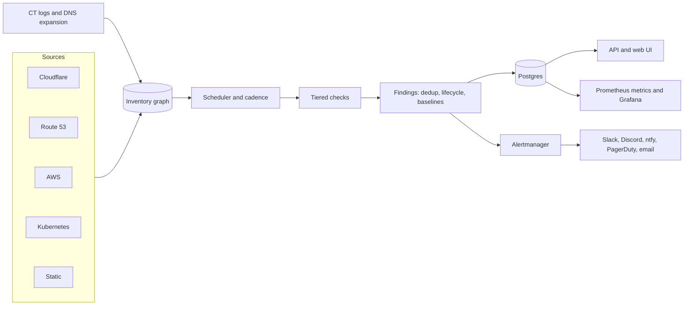

```text
  `      /   .          `              `//   '                  ./ /
   '     .                   . /         .       ` '   /  .       .
`                          /     .              /.           ''
 _______   _______   ______  __  ___      ___      .______       _______
|       \ |   ____| /      ||  |/  /     /   \     |   _  \     |       \
|  .--.  ||  |__   |  ,----'|  '  /     /  ^  \    |  |_)  |    |  .--.  |
|  |  |  ||   __|  |  |     |    <     /  /_\  \   |      /     |  |  |  |
|  '--'  ||  |____ |  `----.|  .  \   /  _____  \  |  |\  \----.|  '--'  |
|_______/ |_______| \______||__|\__\ /__/     \__\ | _| `._____||_______/

  ╷          ▄▒████▄▄████▒▄                    ▄██▄               ▄█▒██▄
▄██▄         ██████████████                    ████               ██████
████         ██▒███████▒▒██ ▄██▒▄           █████▒█▄█████▄        ████████
████  ██████ █▒██▒███▒██▒██ █▒█▒███████████ █████████▒█████▒▒██▒█ ████████
████  ██████ ██████████████ ███████████████ █████████████████████ ████████
██████████████████████████████████████████████████████████████████████████
   E X T E R N A L   A T T A C K   S U R F A C E   M O N I T O R I N G

      h u n t   t h e   r e p l i c a n t s   i n   y o u r   D N S
```

<p align="center">
  <a href="https://github.com/chainseer-xyz/deckard/actions/workflows/ci.yml"></a>
  <a href="LICENSE"></a>
  
  
  
</p>

<p align="center">
  <b>Self-hosted, always-on external attack-surface monitoring.</b><br>
  Point it at Cloudflare, AWS and Kubernetes. It keeps an inventory of everything you expose,
  re-checks it around the clock, and tells you the moment something drifts, dangles or expires.
</p>

<p align="center">
  <a href="#quick-start">Quick start</a> ·
  <a href="#what-it-looks-like">Screenshots</a> ·
  <a href="#what-it-finds">What it finds</a> ·
  <a href="#how-it-works">How it works</a> ·
  <a href="#deploy-on-kubernetes">Helm</a> ·
  <a href="docs/configuration.md">Docs</a>
</p>

---

## Why deckard

Most attack-surface tools are point-in-time scanners you run once and forget. The
things that actually bite you are the ones that change *after* the scan: a CNAME
left pointing at a deleted service, a certificate that quietly stopped renewing, a
port opened for a test, a CVE published last night.

deckard is built for the long haul:

- **Inventory first.** It builds a graph from your real sources (Cloudflare, Route 53,
  Google Cloud DNS, AWS, Kubernetes, static lists), so it knows what you own instead of guessing.
- **Continuous, not periodic.** New assets are scanned immediately; everything else is
  re-checked on a cadence you set, per tier and per check. CVE templates, CISA KEV and
  EPSS data refresh on their own, and a newly exploited CVE triggers a targeted scan.
- **Signal over noise.** Findings are deduplicated, have a lifecycle, resolve themselves
  when the problem goes away, and are ranked. A severity floor decides what reaches your pager.
- **Safe by construction.** A scope guard means it can only ever probe assets you own.
  A source that fails or only partly succeeds never causes anything to be marked removed.
- **One container plus Postgres.** Alerts go through **Prometheus Alertmanager**, so Slack,
  Discord, ntfy, email and PagerDuty all work. Metrics, a Grafana dashboard and a web UI included.

> **Use it only on infrastructure you own or are authorised to test.** See [Responsible use](#responsible-use).

## What it looks like

<p align="center">
  
</p>

The dashboard leads with what needs attention: takeovers, expiring certificates and
actively exploited CVEs first, each with a one-line fix. Source health shows partial or
stale syncs so you never trust an incomplete inventory by accident.

<table>
  <tr>
    <td width="50%"></td>
    <td width="50%"></td>
  </tr>
  <tr>
    <td><sub><b>Investigate a finding</b> without leaving the page: readable evidence, remediation, acknowledge / suppress / false-positive, rescan, copy as Markdown.</sub></td>
    <td><sub><b>Understand an asset</b>: what it is, whether deckard may probe it, its DNS chain with the dead end highlighted, and what changed against its baseline.</sub></td>
  </tr>
</table>

## What it finds

| Tier | Check | Finds |
|---|---|---|
| passive | `dns.dangling` | CNAME chains ending in NXDOMAIN, dangling NS delegations |
| passive | `dns.takeover` | provider takeover fingerprints (S3, GitHub Pages, Heroku, Azure, CloudFront, …) |
| passive | `dns.hygiene` | SPF/DMARC/CAA/DNSSEC gaps, wildcard records, open AXFR |
| passive | `mail.policy` | MTA-STS and TLS-RPT gaps, weak DMARC (`pct`, `sp=none`, no `rua`), `~all` on mail zones |
| passive | `intel.internetdb` | CVEs, unexpected open ports and compromised/malware tags that internet scanners report for your public IPs (Shodan InternetDB) |
| passive | `domain.expiry` | registrations near or past expiry, missing transfer/delete locks, registrar or nameserver changes (RDAP) |
| passive | `domain.lookalike` | registered typosquats and lookalikes of your domains, with mail-capable ones flagged (DNS only, never contacts them) |
| passive | `web.history` | sensitive files and admin surfaces the Wayback Machine saw served on your hostnames (`.env`, `.git`, dumps, actuator) |
| passive | `cloud.bucket` | publicly listable S3, GCS or Azure buckets behind your hostnames |
| passive | `tls.cert` | expiry, hostname mismatch, weak keys, self-signed |
| passive | `http.probe`, `http.headers` | liveness, tech fingerprint, missing security headers |
| passive | `origin.exposed`, `origin.correlation` | CDN origin reachable directly; origin IP published by an unproxied record |
| active | `net.ports`, `net.services` | unexpected open ports, unauthenticated databases and caches |
| active | `tls.config` | TLS 1.0/1.1, weak ciphers |
| active | `http.exposed` | `.git`, `.env`, actuator, backups, directory listings |
| active | `cve.nuclei` | known CVEs and misconfigurations via [nuclei](https://github.com/projectdiscovery/nuclei) templates |

Findings that reference a CVE are ranked by CISA KEV and FIRST EPSS. Add your own checks
with **nuclei templates** (no code) or **exec plugins** in any language
([docs/plugins.md](docs/plugins.md)).

**Real-world catches** from the first run against a production estate: a Cloudflare Pages
project deleted while its CNAME stayed behind (a textbook takeover), CNAMEs to deleted load
balancers, a certificate that had been expired for four months because renewal asked for the
wrong issuer kind, and a CloudFront takeover signature on a staging asset hostname.

## Quick start

```sh
cp .env.example .env            # set DECKARD_ADMIN_TOKEN, POSTGRES_PASSWORD and CF_API_TOKEN
$EDITOR deploy/compose/deckard.yaml
docker compose up -d            # UI on http://127.0.0.1:8080, metrics on :9090
```

Images: `ghcr.io/chainseer-xyz/deckard` (includes the nuclei engine, a pinned official template snapshot,
and deckard's custom finder pack) and
`ghcr.io/chainseer-xyz/deckard:latest-slim` (13 MB, no nuclei; set `nuclei.enabled: false`).
Both run as non-root on a distroless base, signed with cosign, with an SBOM and provenance.

Or run the image directly:

```sh
docker run --rm \
  -e DECKARD_DATABASE__URL=postgres://user:pass@db:5432/deckard \
  -e CF_API_TOKEN=... -e DECKARD_ADMIN_TOKEN=... \
  -v ./deckard.yaml:/etc/deckard/deckard.yaml:ro \
  ghcr.io/chainseer-xyz/deckard:latest serve --config /etc/deckard/deckard.yaml
```

A minimal `deckard.yaml`:

```yaml
sources:
  - { name: cf, type: cloudflare, token_env: CF_API_TOKEN }   # read-only token
notify:
  alertmanager: { urls: ["http://alertmanager:9093"], min_severity: medium }
auth: { mode: token, token_env: DECKARD_ADMIN_TOKEN }
```

The Cloudflare token needs only read permissions: Zone:Read, DNS:Read, Load Balancers:Read
(zone and account), Account Settings:Read, Cloudflare Tunnel:Read.

### Deploy on Kubernetes

```sh
helm install deckard deploy/helm/deckard \
  --set database.cnpg.enabled=true \
  --set-json 'config.sources=[{"name":"cf","type":"cloudflare","token_env":"CF_API_TOKEN"}]' \
  --set 'extraEnvFrom[0].secretRef.name=deckard-secrets'
```

The chart ships a CloudNativePG database option, a NetworkPolicy, a ServiceMonitor, a Grafana
dashboard and, for clusters that route through a Gateway instead of an Ingress, a
**Gateway API `HTTPRoute`** (Envoy Gateway, Istio, Cilium, GKE Gateway, …):

```yaml
httpRoute:
  enabled: true
  hostnames: [deckard.example.com]
  parentRefs:
    - { name: public-gateway, namespace: gateway-system, sectionName: https }
  httpRedirect:                     # optional: send plain HTTP to HTTPS
    enabled: true
    parentRefs:
      - { name: public-gateway, namespace: gateway-system, sectionName: http }
```

The NetworkPolicy automatically admits the namespaces your `parentRefs` point at.

## How it works



- **Sources** discover assets and relationships (hostname → IP → service → cloud resource).
  A source that fails or only partly succeeds never causes assets to be marked removed.
- **Checks** run in three **tiers**: `passive` (about the traffic a browser sends), `active`
  (port and service scanning, rate-limited) and `intrusive` (off unless you enable it for a group).
  Each tier has its own cadence, and new assets are inspected immediately.
- **Findings** are deduplicated, have a lifecycle (open → resolved, with acknowledge, suppress and
  false-positive), and resolve automatically when the issue stops reproducing. Learned baselines
  turn "port 8080 appeared" into a drift finding.
- **Alerts** carry lineage ("api.example.com → Cloudflare → origin 203.0.113.7 → :8080"),
  evidence and remediation, and respect a severity floor.

### Built to run unattended

| What | How |
|---|---|
| Fresh inventory | sources re-sync every few minutes; a new asset is scanned straight away |
| Fresh intelligence | nuclei templates, reference data, CISA KEV and EPSS update on their own; a newly exploited CVE triggers a targeted scan |
| Honest about gaps | partial or stale syncs are flagged in the UI and API and block removals |
| Tells you when it is blind | health alerts for stale sources, a stuck queue, stale feeds; an optional external **heartbeat** for a dead-man's switch |
| Survives crashes | instances heartbeat, and jobs orphaned by a hard kill are reclaimed instead of blocking the queue |
| Vantage point | `scope.resolvers` scans through public DNS so you see your names the way an attacker does |

## Responsible use

deckard sends network traffic to the assets it inventories. It is built so that it cannot be
pointed at things you do not own:

- Every probe goes through a **scope guard**. Only hostnames under zones from your sources (or
  `scope.include`) and IPs you own or explicitly list are ever actively probed. `scope.exclude` always wins.
- Names that resolve to a CDN or third-party edge are **skipped** by the active tier rather than probed.
- Third-party CNAME targets (S3, Heroku, GitHub Pages, …) are only *fingerprinted* by requesting
  **your** hostname. They are never port-scanned.
- Each dial re-checks the resolved IP (defence against DNS rebinding), refuses loopback, link-local
  and cloud-metadata ranges, and sources can never register them as owned.
- A skipped or refused check makes no observation and can never resolve a finding.
- `intrusive` checks are off by default and never triggered automatically.

You are still responsible for having authorisation to test everything in scope, and for your cloud
provider's and CDN's acceptable-use policies.

## How it compares

| | deckard | One-shot recon CLIs (amass, subfinder, nuclei) | Commercial EASM |
|---|---|---|---|
| Runs continuously, remembers state | yes | no, you script it | yes |
| Knows what you own from your own accounts | yes | no | partly |
| Findings lifecycle, baselines, dedup | yes | no | yes |
| Self-hosted, your data stays yours | yes | yes | no |
| Cost | free (Apache-2.0) | free | per-asset pricing |
| Extensible with nuclei templates and plugins | yes | n/a | rarely |

deckard builds on those tools (it runs nuclei) rather than replacing them: they find, it remembers,
correlates and alerts.

## Metrics, alerting and operations

Prometheus metrics (default `:9090/metrics`) expose posture, not per-finding labels, so cardinality stays
bounded: `deckard_assets`, `deckard_findings_open`, `deckard_checks_skipped_total`,
`deckard_scan_errors_total`, `deckard_source_last_success_timestamp`, `deckard_queue_depth`, plus the
freshness and exploit-intelligence series (full list in
[docs/operations.md](docs/operations.md#metrics)). A Grafana dashboard ships in the Helm chart (it can be
filed into a folder with `metrics.dashboard.annotations`), and `deploy/examples/` has an Alertmanager
config (Slack, Discord, ntfy) and alert rules for deckard's own health.

## Configuration

Everything is YAML plus `DECKARD_`-prefixed environment variables (`__` for nesting, env wins). The full
reference is in [docs/configuration.md](docs/configuration.md); validate with
`deckard config validate --config deckard.yaml`. Per-tier cadence, per-check intervals, asset-group
overrides, suppressions and baselines are all configurable.

## Commands

```
deckard serve             run API, scheduler and workers (roles via server.roles)
deckard migrate           apply database migrations
deckard sync              one inventory sync
deckard scan              sync, scan everything due, notify, print a summary
deckard findings          print current findings (--min-severity, --status, --format table|json)
deckard config validate   check a config file
```

Run several replicas by splitting roles: API pods plus worker pods against the same Postgres (see the
Helm `worker.enabled` option).

## API

A documented REST API (OpenAPI 3.0, [docs/openapi.yaml](docs/openapi.yaml)) backs the UI and is meant for
automation: list and filter findings and assets, acknowledge or suppress, trigger a rescan or a source
sync, and stream changes over server-sent events. An end-to-end suite in [tests/e2e](tests/e2e) checks a
deployed instance against that spec.

External scanners (Prowler, Kubescape, trufflehog, gitleaks, s3scanner, any SARIF producer) can post their findings into the same lifecycle with `deckard ingest`, without deckard ever reaching their targets: see [docs/ingest.md](docs/ingest.md). `deckard ingest prowler-app` pulls the findings of every provider of a running Prowler App (AWS, GCP, Azure, GitHub, Kubernetes, ...) into the same lifecycle.

## Development

```sh
make test         # go test -race ./...  (Postgres tests use Docker via testcontainers)
make build        # static binary in bin/
make web          # build the UI (Node 22)
deploy/helm/tests/render_test.sh
```

See [CONTRIBUTING.md](CONTRIBUTING.md). The design lives in [docs/superpowers/specs](docs/superpowers/specs).

## Security

Report vulnerabilities privately; see [SECURITY.md](SECURITY.md).

## License

Apache-2.0. See [LICENSE](LICENSE).

<sub>Keywords: attack surface management, external attack surface monitoring, EASM, subdomain takeover,
dangling DNS, certificate expiry monitoring, Cloudflare, Route 53, Kubernetes, nuclei, Prometheus,
Alertmanager, self-hosted security monitoring.</sub>
